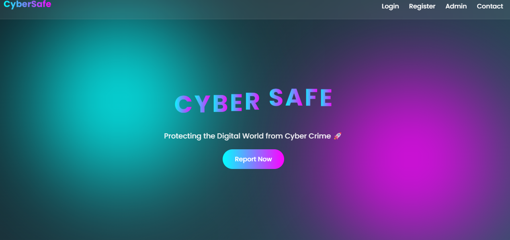
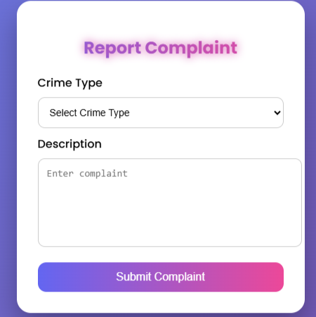
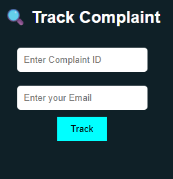

# Cyber Crime Management System

## 📌 Description
This is a web-based application developed using PHP and MySQL to manage cyber crime complaints.

## 🚀 Features
- User Registration & Login
- Report Complaint
- Track Complaint Status
- Admin Dashboard

## 🛠️ Technologies Used
- PHP
- MySQL
- HTML, CSS

## ▶️ How to Run
1. Install XAMPP
2. Move project to htdocs
3. Start Apache & MySQL
4. Open http://localhost/CYBER_PROJECT
   ## Screenshots

### Login Page

### Home Page

### Report Complaint

### Track Complaint

